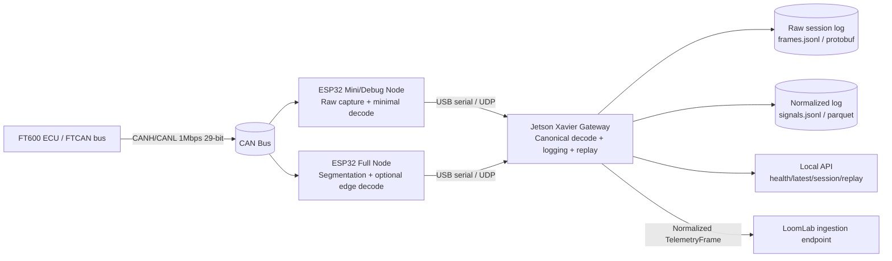
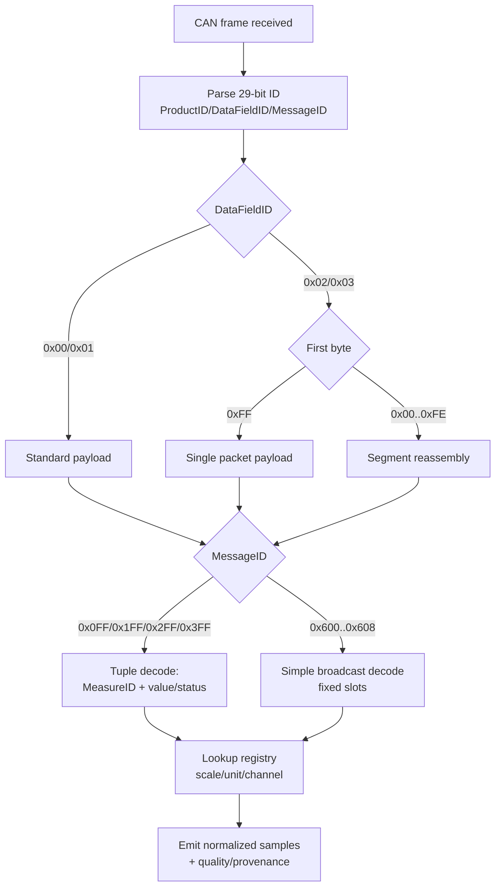

# Future‑Proof, System‑Agnostic FT600/FTCAN Telemetry Gateway and Bench Stack

## Executive summary

This report specifies a **bench‑first, read‑only telemetry stack** that ingests **FuelTech FT600 FTCAN 2.0** traffic using **ESP32 + external CAN transceiver nodes**, forwards frames to a **Jetson Xavier gateway**, and emits **normalized, system‑agnostic signals** into LoomLab. The core design goal is to preserve a **single source of truth (SSOT)** for protocol decoding and channel metadata while enabling deterministic **session logging + replay** and robust validation against real hardware.

FuelTech’s FTCAN 2.0 protocol runs on **CAN 2.0B extended mode at 1 Mbps** and uses the **29‑bit identifier** to encode `ProductID`, `DataFieldID`, and `MessageID`. citeturn3view1 The protocol defines four data-field layouts (`0x00..0x03`), mandates **big‑endian** encoding for data payload values, and provides two broadcast styles: (1) **real‑time reading broadcast** (`MessageID 0x0FF/0x1FF/0x2FF/0x3FF`) carrying `MeasureID + value/status` tuples and (2) **real‑time simple broadcast** (`MessageID 0x600..0x608`) at a documented **100 Hz**, using fixed payload positions, plus a separate “simplified packets” table that maps the `0x600..0x608` broadcasts to concrete ECU signals. citeturn3view4turn3view5turn4view0

On the embedded side, ESP32’s **TWAI** peripheral (CAN controller) supports **11‑bit and 29‑bit IDs** and classical CAN framing compatible with ISO 11898‑1, but requires an **external transceiver** to interface with the physical bus. citeturn13view0turn5search12 TWAI exposes fault confinement (error states, bus‑off) and alerts (RX queue full, bus errors, bus‑off, recovery complete), which must be treated as first‑class diagnostics and health signals in the node firmware. citeturn13view2turn13view1

On the gateway side, the Xavier should be the **canonical decoder and validator** (even if the “full” ESP32 node also decodes), because this is where you can ensure deterministic logging, safe buffering/backpressure handling, monotonic timestamping, and replay. Linux provides `CLOCK_MONOTONIC` for interval timing that is not subject to wall‑clock jumps, which is ideal for ordering and replay. citeturn9search0

This report also includes a practical ingestion contract recommendation for LoomLab: a `TelemetryFrame` schema that stores normalized signal samples plus provenance, quality flags, and traceability metadata, without leaking protocol internals.

(Internal project brief reference) fileciteturn0file0

## FTCAN 2.0 protocol deep dive

### Physical layer and framing

FuelTech defines FTCAN 2.0 as operating over **CAN 2.0B extended mode at 1 Mbps**, with a CAN frame comprised of a **29‑bit identifier** and up to 8 data bytes. citeturn3view1 This implies:

- Your CAN interface must accept **extended (29‑bit) frames**, not only standard 11‑bit IDs.
- Your bus timing must be set to **1,000,000 bit/s**; a mismatch will look like “garbage” frames, sporadic errors, or total silence.

### 29‑bit identifier decomposition

FuelTech defines the 29‑bit ID layout as: citeturn3view1

- Bits **28..14** (15 bits): `ProductID`
- Bits **13..11** (3 bits): `DataFieldID`
- Bits **10..0** (11 bits): `MessageID`

`ProductID` is further decomposed into: citeturn3view1

- Bits **14..5** (10 bits): `ProductTypeID`
- Bits **4..0** (5 bits): unique identifier (0x00..0x1F)

FuelTech documents that this enables up to **32 devices of the same product type** on one bus (unique id range 0x00..0x1F). citeturn1view0

FuelTech also defines `ProductID` priority ranges (lower ID = higher bus priority): **Critical 0x0000..0x1FFF**, **High 0x2000..0x3FFF**, **Medium 0x4000..0x5FFF**, **Low 0x6000..0x7FFF**. citeturn1view0

### ProductID ranges for FT600

FuelTech’s ProductID list explicitly assigns **FT600 ECU** to `ProductTypeID 0x0281` with `ProductID` range **0x5020..0x503F**. citeturn3view3  
This is crucial because it gives you a robust filter on mixed networks:

- If `ProductID ∈ [0x5020, 0x503F]` ⇒ likely FT600 ECU frames
- You can still record *everything* for debugging, but treat this filter as the “expected primary producer” on a bench setup.

### DataFieldID types and why they matter

FuelTech defines four possible `DataFieldID` layouts: citeturn1view0turn3view2

- `0x00`: Standard CAN data field (no segmentation)  
- `0x01`: Standard CAN data field via bridge/gateway/converter  
- `0x02`: FTCAN 2.0 data field (segmentation enabled)  
- `0x03`: FTCAN 2.0 data field via bridge/gateway/converter  

FuelTech states that **all values in the DATA FIELD are transmitted as big‑endian**. citeturn1view0turn3view2  
Implication: every 16‑bit (and larger) multi‑byte value must be parsed as big‑endian.

### MessageIDs for real‑time broadcast

FuelTech defines the real‑time reading broadcast MessageIDs: **0x0FF, 0x1FF, 0x2FF, 0x3FF**, mapped to critical/high/medium/low priority categories. citeturn3view4  
FuelTech describes them as the message IDs used to transmit real‑time readings, with broadcast rate depending on the type of data (critical data more frequently, high‑priority includes signals like RPM/MAP/TPS). citeturn3view4

FuelTech defines the **real‑time datum format** as 4 bytes: citeturn3view4

- bytes 0–1: `MeasureID` (big‑endian)
- bytes 2–3: value or status (big‑endian)

Value vs status details: citeturn3view4
- Values: **signed 16‑bit**, big‑endian  
- Statuses: **unsigned 16‑bit**, big‑endian  

If more than one reading is broadcast in one transmission, it can be carried in a **segmented packet** as multiple 4‑byte tuples. citeturn3view5

### Real‑time simple broadcast (0x600..0x608) and simplified packets

FuelTech defines a second set of MessageIDs: **0x600..0x608**, described as “real‑time simple broadcast”, using a fixed set of measures at a documented **100 Hz** rate, transmitted using a **standard CAN data frame (`DataFieldID 0x00`)** with four 16‑bit big‑endian signed values per frame. citeturn3view5

FuelTech then provides a “simplified packets” table for ECUs showing the mapping of `0x600..0x608` to real fields. For FT600/550/450 the full 29‑bit identifiers include examples like: citeturn4view0

- `0x14080600`: TPS, MAP, Air Temp, Engine Temp  
- `0x14080601`: Oil Pressure, Fuel Pressure, Water Pressure, Gear  
- `0x14080602`: Exhaust O2, RPM, Oil Temp, Pit Limit  
- `0x14080603`: Wheel Speeds (FR/FL/RR/RL)  
- `0x14080604..08`: traction control, shocks, g‑force/yaw, lambda correction/fuel flow, trans temp/fuel consumption/brake pressure  

FuelTech explicitly states the simplified packets use the **same data format, units, and multipliers** as the standard packets. citeturn4view0  
Engineering implication: you can implement **one canonical registry** of “measures” and let both:
- “MeasureID tuple parser” and
- “Simplified message parser”  
emit samples into the same normalized channels.

### MeasureID registry: value/status bit, units, scaling

FuelTech defines `MeasureID` so that the least significant bit indicates whether the following word is a value or a status. citeturn3view6

- Bit0 = 0: data value  
- Bit0 = 1: data status

FuelTech’s table provides **MeasureID, DataID, description, unit, multiplier, and broadcast source/rate**. For the GTM bench starter set (examples from the table): citeturn3view6

- `0x0002`: TPS (%) scale 0.1  
- `0x0004`: MAP (bar) scale 0.001  
- `0x0006`: Air temp (°C) scale 0.1  
- `0x0008`: Engine temp (°C) scale 0.1  
- `0x000A`: Oil pressure (bar) scale 0.001  
- `0x000C`: Fuel pressure (bar) scale 0.001  
- `0x0012`: ECU battery voltage (V) scale 0.01  
- `0x0018..0x001E`: wheel speeds (km/h) scale 1  
- `0x0020`: driveshaft RPM scale 1  
- `0x0022`: gear (Note‑based encoding)  
- Lambda/O2 measures appear with unit “λ” and scale 0.001 citeturn3view6

### Segmented packets: structure and reassembly rules

FuelTech defines segmentation for `DataFieldID 0x02` (FTCAN 2.0): citeturn1view0turn3view2

- Single packet: first byte = **0xFF**, remaining 7 bytes are payload.
- Segmented packet: first byte = **0x00..0xFE** identifying the segment index.
  - Segment 0 contains 2 bytes of segmentation metadata after the `0x00`, describing payload length.
  - Subsequent segments carry payload continuation.

FuelTech specifies maximum payload length as **1776 bytes**. citeturn1view0  
FuelTech provides a segmented flowchart describing expected receiver behavior (discard on unexpected sequence, allocate buffer based on total length, etc.). citeturn4view3  
Engineering implication: your “full” decoder must support segmentation; your “mini/debug” firmware may treat segmented payloads as raw capture only (still recording) if you want the simplest fallback.

### Connector pinout

FuelTech documents the PowerFT ECU CAN connector pinout; the diagram explicitly labels **GND**, **CAN HI**, and **CAN LO**. citeturn4view1  
Bench implication: you should include a signal/chassis reference (GND) in addition to CANH/CANL, especially in noisy environments.

### Worked example and how to verify your implementation

FuelTech provides a worked decode example (“Standard CAN layout – Single packet with RPM value”) showing how to extract `ProductID`, `DataFieldID`, `MessageID`, and to interpret a payload containing `MeasureID 0x0084` and value `0x07D0` = 2000 RPM. citeturn4view2  
Use this as a golden test fixture for your decoder implementation.

## ESP32 + CAN node design

### Why ESP32 TWAI is viable and what must be engineered around

ESP32’s TWAI is compatible with ISO 11898‑1 classical CAN framing and supports both **standard (11‑bit) and extended (29‑bit) identifiers**. citeturn13view0turn5search12 However, TWAI is a controller, not a physical transceiver; you need an external CAN transceiver to drive the differential lines. citeturn5search12

TWAI provides explicit fault confinement states and recovery mechanisms. For example, bus‑off is entered when the transmit error counter reaches ≥256, and recovery requires observing recessive bits on the bus (bus‑free signal) before returning to stopped. citeturn13view1 The TWAI driver exposes alerts including **RX queue full**, **bus error**, **bus‑off**, and **bus recovered**, and uses an error warning limit (default 96) for early warning. citeturn13view2  
This means production‑quality firmware must include:

- a diagnostic counters subsystem (drops, overruns, bus‑off, recovery cycles)
- a health heartbeat
- a watchdog strategy that can restart TWAI or reboot safely when stuck

### Transceiver choice: SN65HVD230 as prototype vs automotive‑robust options

Your breakout modules based on **SN65HVD230** are valid for bench development because they are 3.3‑V CAN transceivers compatible with **ISO 11898‑2** and designed for up to **1 Mbps**. citeturn5search7turn0search6turn5search3 They also advertise strong ESD performance (bus pin ESD exceeding ±16 kV HBM). citeturn5search3

However, “future‑proof” car deployment often benefits from fault‑protected transceivers providing stronger bus fault tolerance and wider common‑mode range. For example, TI’s **TCAN1042** family advertises features like bus fault protection (±58 V / ±70 V variants), high ESD robustness, and receiver common‑mode input voltage up to ±30 V. citeturn6search14turn6search6  
Recommendation: treat SN65HVD230 as **bench + early integration**, and define a later upgrade path to an automotive‑grade transceiver (or isolated CAN) once you move from bench to in‑car.

### Wiring, termination, topology, and EMC protection

For high‑speed CAN, the CAN in Automation guidance recommends a **line topology terminated at both ends with 120‑ohm resistors**, sometimes implemented as split termination (2×60Ω + capacitor). citeturn10view0  
Design implications for your bench harness:

- Ensure exactly **two terminations** on the bus ends.
- Keep stubs short; your ESP32 node should be close to the “main line” segment.

For EMC/ESD robustness, multiple vendor application notes converge on key layout/protection guidance:

- **Common‑mode chokes** can improve EMC but can also introduce unexpected transients and should be chosen/placed carefully. citeturn6search0turn6search1  
- If used, the choke should be placed close to the transceiver CANH/CANL pins. citeturn6search1turn6search8  
- **Suppressor diodes/varistors** for ESD should be connected close to the ECU connector/bus terminals, not deep inside the board. citeturn7search1turn7search0  

Practical prototype recommendation (incremental hardening path):

- Phase 1 (bench): SN65HVD230 + correct termination + twisted pair + good ground reference.
- Phase 2 (car): add TVS/ESD diodes at connector, optional common‑mode choke if EMC requires it, upgrade transceiver, add input protection on power.

### Mini/debug firmware vs full firmware architecture

The most robust strategy is two firmware profiles that share protocol truth (registry/decoder core) but differ in responsibilities:

**Mini/debug node (fallback + bench probe)**  
Goals: never “fancy fail”, always capture.

- Configure TWAI for 1 Mbps and accept extended IDs (FTCAN requires extended). citeturn3view1turn13view0  
- Output raw frames in a simple transport format (newline‑delimited JSON or compact binary).
- Minimal optional decoding: only a small visible subset (TPS/MAP/temps/voltages), using the same registry.
- Always report TWAI alerts/counters (RX queue full, bus errors, bus off). citeturn13view2  

**Full node (edge decode + richer ops)**  
Goals: reduce bandwidth, provide local caching/diagnostics, support segmentation.

- Full segmentation reassembly for `DataFieldID 0x02`, including sequence validation and buffer lifecycle as described by FuelTech. citeturn3view2turn4view3  
- Optional edge decoding to normalized signals (still validated by Xavier).
- Diagnostics: per‑ID frame rates, unknown ID counts, segmentation errors, bus health state machine.
- Configurable filtering profiles (e.g., “broadcast only core engine signals”).

### Transport options to Xavier: comparison table

Below is the practical comparison for ESP32→Xavier transport (not “theory best”, but bench‑stack reality).

| Transport | Pros | Cons | Best use |
|---|---|---|---|
| USB Serial (CDC/TTY) | Simple, deterministic, no Wi‑Fi noise; easy bench bring‑up | Cable constraints; serial bandwidth ceiling; hot‑unplug issues | Bench dev, first end‑to‑end proof |
| UART direct | Works without USB stack; robust link | Needs level/ground discipline; wiring effort | Embedded in‑car wiring hub |
| Wi‑Fi UDP | Low latency; simple; can broadcast | Packet loss/no ordering; needs buffering/seq numbers | High‑rate streaming when you can tolerate loss |
| Wi‑Fi WebSocket | Ordered stream; easy client consumption | More overhead; reconnect complexity | Human‑facing live dashboards |
| Ethernet (if available) | Best determinism and throughput | Hardware complexity (PHY), wiring | “Production” in‑car gateway networks |

Recommendation: USB Serial is usually the **fastest path to correctness**; once decode/log/replay are solid, move to UDP/WebSocket if required.

### Configuration and diagnostics contract for nodes

Treat your nodes as appliances that emit:

- **Raw frame stream**: `id29`, `dlc`, `data[0..7]`, `rx_ts_ms` (source local)  
- **Node health stream**: uptime, TWAI state, error counters, drops, bus‑off count, last recovery time, rx queue full count (TWAI provides `RX_QUEUE_FULL` alert). citeturn13view2  

Critically, the node must include a monotonically increasing **sequence number** in its output so the Xavier can detect drops and reorder (especially for UDP).

## Xavier gateway and edge compute design

### Xavier responsibilities vs ESP32 responsibilities

A future‑proof gateway typically assigns responsibilities as follows:

ESP32 nodes:
- Physical CAN interface + basic filtering/counters
- Optional *convenience decoding* (never the authoritative truth)

Xavier gateway:
- **Canonical decode (authoritative)**
- Monotonic timestamping, session lifecycle, durable logging
- Replay + comparison tooling
- Export APIs and LoomLab ingestion client

This split makes failures diagnosable (raw vs decoded vs normalized) and avoids “silent wrongness.”

### Variant choice and thermal/enclosure strategy

NVIDIA documents Jetson Xavier NX power modes and monitoring (overcurrent thresholds, throttling behavior) within its Jetson Linux developer documentation. citeturn0search3turn8search12 Jetson platforms commonly rely on thermal management policies including fan control mapping and weighted thermal zone temperatures. citeturn8search1  
Practical implication: the Xavier must not be placed in a sealed enclosure without a deliberate thermal path or cooling strategy.

A third‑party integrator summary describes active vs passive heatsinks, emphasizing that active heatsinks are suitable for closed boxes without airflow, while passive solutions may suffice where convection/airflow exists. citeturn8search8

**Enclosure strategy comparison (Xavier class compute)**

| Enclosure approach | Pros | Cons | When to choose |
|---|---|---|---|
| Open frame + heatsink/fan | Best thermals; easiest debugging | No environmental protection | Bench and early integration |
| Vented metal enclosure + fan | Good protection + airflow | Needs dust filtering strategy | In‑car but protected cabin zone |
| Sealed enclosure + thermal coupling to case | Environmental sealing | Thermal engineering required; risk of throttling | Only if you design heat spreader + external fins |
| Industrial fanless “box PC” style | Turnkey ruggedization | Cost; less flexible | When you want “appliance” stability |

### Monotonic timestamping and replay correctness

Use monotonic time for ordering and replay. Linux `CLOCK_MONOTONIC` is specifically designed to avoid discontinuous wall‑clock jumps (though it can be slewed by NTP). citeturn9search0turn9search12  
A recommended model is:

- `ts_mono_ns`: `clock_gettime(CLOCK_MONOTONIC)` at ingest time
- `ts_wall_ns`: `CLOCK_REALTIME` for human correlation
- `source_seq`: ESP32 frame sequence number
- `source_ts_ms`: ESP32 local timestamp (optional)

### Session/log storage formats: comparison table

| Format | Pros | Cons | Best use |
|---|---|---|---|
| JSONL (raw + normalized) | Human readable; easy streaming; line‑split; widely tooled | Larger; slower write/parse than binary | Early dev, debugging, fixtures |
| Protobuf (binary) | Compact, fast, cross‑language codegen citeturn9search7turn9search3 | Harder to inspect; schema evolution discipline needed | Production transport + archive |
| SQLite (WAL mode) | Single file DB; indexed queries; durable; WAL supports concurrency | WAL best with smaller txns; large txns can be problematic citeturn11search1 | “Hot” rolling storage, last‑N queries |
| Parquet | Columnar format optimized for analytics & compression citeturn11search0turn11search8 | Batch‑oriented; less convenient for live streaming | “Cold” analytic archive, offline analysis |

JSON Lines itself is defined as “each line is a valid JSON value” and is explicitly suitable for record‑by‑record processing. citeturn11search2

Recommendation:
- **v1**: raw JSONL + normalized JSONL + optional SQLite “latest state”
- **v2**: keep raw JSONL for debug, add Protobuf for efficient production storage/transport
- **v3**: export Parquet for analysis pipelines

### Deployment models on Xavier: comparison table

| Model | Pros | Cons | Best use |
|---|---|---|---|
| `systemd` service | Simple, native, robust restart policies; observability via journal citeturn9search9turn9search0 | Less sandboxing | Early production appliance |
| Docker container | Repeatable builds; dependency isolation; portable | Logging/rotation must be managed; GPU runtime if needed | When you want reproducible deployment |
| Docker Compose | Multi‑service orchestration | More moving parts | When gateway grows into multiple services |
| k3s (lightweight Kubernetes) | Edge‑friendly, <100MB binary; designed for resource‑constrained edge citeturn12search3 | Operational complexity | Only if you manage many nodes/vehicles |

For containers on Jetson, NVIDIA states Docker is included with JetPack and running containers is straightforward. citeturn12search2  
If you do containerize, use Docker’s documented restart policies and log drivers; for example Docker documents that restart policies only take effect after a container has started successfully and provides guidance on managing automatic restarts. citeturn12search4

Recommendation:
- Start with `systemd` on Xavier for v1 (lowest friction).
- Optionally add Docker later if dependency isolation becomes a limiting factor.

### Gateway API and observability

Minimum APIs (local, not LoomLab‑facing yet):

- `GET /health` (node counts, last frame times, bus‑off count, decoder errors)
- `POST /session/start`, `POST /session/stop`
- `GET /signals/latest` (latest normalized values + freshness + quality)
- `POST /replay` (start replay from session file at speed factor)

Observability to implement from day one:

- Counters: frames in/out, drops, unknown IDs, segmentation errors
- Gauges: queue depth, CPU load, disk write throughput, session size
- Structured logs (and rotation policy)

## Canonical registry, codegen, and decoder engineering

### Single SSOT strategy

The highest‑leverage decision is to define one canonical registry file and generate runtime artifacts for:

- ESP32 C++ firmware
- Xavier Python gateway
- (optional) TypeScript tooling and LoomLab ingestion client

This prevents “split brain” where device firmware and gateway disagree silently.

**Recommended SSOT artifact:** `measure-registry.json` generated from FuelTech’s MeasureID tables and simplified packet mappings.

### Required registry fields

Your registry needs more than “scale/unit” if you want correctness and future‑proofing. Minimum recommended fields (some are derived or optional):

- `measureId` (hex int) or `dataId` (15‑bit) + `isStatus`
- `channel` (stable normalized name, e.g., `engine.tps_pct`)
- `label` (human display)
- `unit` (canonical, e.g., `%`, `bar`, `°C`, `V`, `rpm`, `km/h`, `lambda`)
- `scale` (multiplier from FuelTech table) citeturn3view6
- `signed` (true for values, false for statuses per FuelTech rules) citeturn3view4
- `statusId` (derived: value measureId + 1) citeturn3view6
- `expectedRateHz` (from FuelTech broadcast source/rate if provided) citeturn3view6
- `packetFamilies` (e.g., `realtime_tuple`, `simple_0x600`, `simplified_ecu`)
- `tags` (engine/pressures/temps/driveline/wheels)
- `validRange` (engineering plausibility bounds, project‑defined)
- `qualityRules` (how to treat status, stale intervals, invalid status)

### Code generation approach

- Authoritative registry in JSON.
- Generator script emits:
  - C++ `constexpr` tables for ESP32 (minimal footprint)
  - Python dicts / dataclasses for Xavier
  - TypeScript types for test tools and LoomLab adapter

You can validate generated artifacts in CI by:
- hashing registry file
- verifying generated outputs match committed artifacts, or regenerating at build time.

### Decoder rules that must be enforced

FuelTech defines critical low‑level rules:

- Payload values are **big‑endian**. citeturn1view0turn3view2  
- Real‑time tuple values are **signed 16‑bit**, statuses are **unsigned 16‑bit**. citeturn3view4  
- `MeasureID` bit 0 indicates value vs status. citeturn3view6  
- Segmentation uses first byte as segment index; `0xFF` indicates single packet. citeturn3view2  

Your decoder must therefore implement:

**Value vs status handling**
- If `measureId & 0x1 == 0`: interpret as signed, scale, emit sample
- If `measureId & 0x1 == 1`: interpret as unsigned, store status, propagate quality flag

**Unknown IDs**
- Store raw frames always.
- For unknown `MeasureID` or unknown 29‑bit IDs: increment counters and optionally emit an “unknown.*” debug stream, but do not guess scaling.

**Simplified packet mapping to registry**
- Treat simplified packets as fixed slot mappings that emit the same normalized channels using the same scale/unit metadata.
- This is explicitly allowed because FuelTech states the simplified packets use the same format/unit/multipliers as standard packets. citeturn4view0

**Segmentation reassembly**
- Reassemble only for `DataFieldID 0x02` and `0x03` (FTCAN); ignore for `0x00/0x01`. citeturn1view0turn3view2  
- Implement sequence checks and discard behavior consistent with FuelTech’s flowchart. citeturn4view3

### Canonical FTCAN ID parsing snippet (conceptual)

FuelTech’s ID structure is mechanical; implement it once and reuse everywhere. citeturn3view1  
(Provide as design guidance; the authoritative bit layout comes from FuelTech.)

### Mermaid diagrams

**Overall architecture**



**Real‑time decode dataflow**



**Replay flow**

```mermaid
flowchart LR
  S[Session file: raw frames] --> R[Replay engine\nmonotonic schedule]
  R --> D[Canonical decoder]
  D --> Q[Quality + staleness rules]
  Q --> O[Output stream\nAPI/WebSocket/LoomLab ingest]
  D --> N[Normalized log\n(replay output)]
  O --> V[Comparison harness\nlive vs replay\nESP32 vs Xavier]
```

## Bench testing, fixtures, determinism, and acceptance criteria

### Bench‑first fixture strategy

FuelTech’s worked example and tables are enough to build synthetic fixtures:

- ID parsing examples (e.g., 0x140001FF) citeturn4view2  
- MeasureID scaling examples (TPS/MAP/temps/etc.) citeturn3view6  
- Simplified packet IDs and slot mapping (0x14080600..08) citeturn4view0  
- Segmentation rules and flowchart citeturn3view2turn4view3  

Fixture set recommendations:

- `fixture_realtime_tuple_rpm_2000`: from FuelTech example 2000 RPM citeturn4view2  
- `fixture_simplified_0x14080600`: TPS/MAP/Temps
- `fixture_simplified_0x14080603`: wheel speeds
- `fixture_segmented_multi_measure`: simulate segmentation reassembly with deliberate missing segment to test discard rules

### Expected FT600 bench behavior

The FTCAN spec defines how values are encoded and broadcast but does not guarantee *which* measures will be “live” on a bench with no sensors attached. Your validation plan should anticipate:

- values that remain at defaults (0 or fixed)
- status words indicating invalid/unavailable
- broadcast subsets depending on ECU configuration and mode

This is exactly why the system must log raw frames and include quality flags and provenance (live vs synthetic vs replay).

### Soak and determinism tests

Deterministic replay acceptance should prove:

- ingest → log → replay produces identical normalized output when replaying the same raw frames
- ordering is stable (monotonic clock based scheduling) citeturn9search0

Soak tests:

- 30 minutes: confirm no memory leak or buffering growth
- 2 hours: confirm no file corruption and consistent disk write rates
- overnight: confirm log rotation policy and recovery behavior

### Acceptance criteria ladder

**Gate: protocol decoding correctness**
- Pass all fixtures for:
  - big‑endian parsing citeturn1view0turn3view2
  - signed vs unsigned handling citeturn3view4
  - MeasureID LSB value/status rules citeturn3view6
  - simplified packet slot mapping citeturn4view0
  - segmentation reassembly flowchart rules citeturn4view3

**Gate: ESP32 mini/debug reliability**
- 30‑minute bench capture with zero crashes
- RX queue full count is zero (or explainable), TWAI health telemetry emitted citeturn13view2

**Gate: Xavier logging and replay**
- writes raw + normalized logs
- replays a session deterministically (byte‑for‑byte normalized output match)

**Gate: cross‑verification**
- ESP32 full decoded subset matches Xavier canonical decode for the same raw capture (mismatch detection tool reports zero semantic mismatches)

## LoomLab ingestion contract and multi‑bus future‑proofing

### Multi‑bus strategy and naming conventions

Even if v1 is “only FT600”, design for multiple buses now:

- `ftcan0` (FT600)
- `gmcan0` / `obd0` (LS1/GM path; actual interface is an open item)
- `chassiscan0` (ABS, dash, body)

Signal naming conventions should remain stable and system‑agnostic:

- `engine.*` (rpm, tps, map, temps, pressures)
- `electrical.*` (battery voltage)
- `vehicle.wheel_*` (wheel speeds)
- `driveline.*` (gear, driveshaft rpm)
- `lambda.*` (bank/exhaust/avg)

Add provenance tags to every signal:

- `source.protocol = "ftcan"`
- `source.productId = 0x5020`
- `source.bus = "ftcan0"`
- `source.mode = live|synthetic|replay`

This preserves traceability without forcing LoomLab to know FuelTech’s protocol.

### Canonical frame schema draft for LoomLab

A normalized ingestion schema should carry:

- monotonic + wall timestamps
- device and stream identity (ties into LoomLab “devices/streams/sessions”)
- channel name, value, unit
- quality flags and optional status word
- provenance and trace metadata

Example `TelemetryFrame` (JSON representation):

```json
{
  "ts_mono_ns": 1234567890123,
  "ts_wall_rfc3339": "2026-04-06T14:12:33.123Z",
  "device_id": "gtm-ft600-bench",
  "stream_id": "ftcan0",
  "session_id": "sess_2026-04-06_bench_001",
  "channel": "engine.map_bar",
  "value": 1.245,
  "unit": "bar",
  "quality": "good",
  "status_u16": 0,
  "provenance": {
    "mode": "live",
    "protocol": "ftcan",
    "product_id": 20512,
    "message_id": 1536,
    "measure_id": 4,
    "source_seq": 998123
  }
}
```

### Minimal LoomLab DB and API changes

Assuming LoomLab already models devices/streams/sessions, the minimal addition set is:

- A `telemetry_frames` store (hot path) or `telemetry_samples` table:
  - partitioned or bucketed by session and stream
  - optional “latest value” table for fast dashboards
- Ingestion API:
  - `POST /api/telemetry/ingest` accepting batches of frames
  - auth boundary based on gateway identity
- Session model glue:
  - ability for gateway to open/close sessions (or auto‑session by activity)

Traceability without protocol leakage:
- Store protocol metadata in `provenance` fields, but do not expose raw CAN parsing rules inside LoomLab.
- Keep raw frames in gateway storage, and only store references/hashes if LoomLab needs audit trails.

## Sprint plan, artifacts, risk register, and open questions

### Concrete artifacts to produce

These artifacts form the “definition of done” for a bench‑proven stack:

**Canonical protocol + registry**
- `shared/protocol/ftcan/measure-registry.json`
- `shared/protocol/ftcan/id_parser.*` (bit extraction)
- `shared/protocol/ftcan/framing.*` (DataFieldID parsing + segmentation)
- `shared/protocol/ftcan/decoder_core.py`
- `shared/protocol/ftcan/decoder_core.ts` (optional, mostly for tools/tests)

**ESP32 firmware**
- `esp32-mini-debug/` PlatformIO project (raw capture + minimal decode)
- `esp32-full/` PlatformIO project (segmentation + optional decode + counters)

**Xavier gateway**
- `xavier-gateway/` Python app:
  - serial/UDP ingest
  - canonical decode
  - raw + normalized JSONL logs
  - replay engine
  - local API
- `systemd/gtm-gateway.service`
- `scripts/install.sh` (deploy + enable service)

**Testing + verification**
- `fixtures/ftcan/` synthetic packet set (tuple/simple/segmented)
- `tools/compare_decode.py` (ESP32 vs Xavier mismatch tool)
- `tools/replay_session.py` (deterministic replay tool)

### Single mega‑sprint milestone plan (with time estimates)

Assumptions:
- 1 primary engineer integrating + 1–2 “Cursor sub‑agents” producing modules in parallel
- bench access to FT600 harness for at least one validation day
- estimates include integration + test time, not only code generation

| Milestone | Deliverables | Acceptance criteria | Est. time |
|---|---|---|---|
| Protocol SSOT landing | `measure-registry.json`, ID parser, decode rules | FuelTech example decodes correctly (RPM 2000) citeturn4view2 | 1–2 days |
| Fixture suite | tuple + simplified + segmented fixtures | CI: all fixtures pass; segmentation discard rules validated citeturn4view3 | 1–2 days |
| ESP32 mini/debug | raw capture + minimal decode + health | 30‑min soak, no crashes; emits TWAI alert counters citeturn13view2 | 1–2 days |
| Xavier ingest + logs | serial ingest, raw JSONL writer | sustained ingest; no dropped lines; logs written | 1–2 days |
| Xavier canonical decode | normalized JSONL output | decodes simplified packets (0x14080600 etc.) correctly citeturn4view0 | 2–4 days |
| Replay engine | monotonic replay scheduler | replay output equals original normalized output citeturn9search0 | 2–3 days |
| ESP32 full build | segmentation + richer counters | segmented fixtures pass; counters exposed; no runaway memory | 2–4 days |
| Comparison tool | ESP32 vs Xavier mismatch | zero mismatches on fixtures and bench capture | 1–2 days |
| LoomLab ingestion stub | TelemetryFrame schema + ingest client | gateway can POST normalized frames to a stub endpoint | 1–2 days |

### Risk register with prioritized mitigations

| Risk | Failure mode | Impact | Mitigation |
|---|---|---|---|
| Wrong CAN bitrate / ID mode | no frames, bus errors | Blocks progress | Hardcode 1 Mbps + extended mode per FuelTech citeturn3view1; add “bitrate sanity” checklist |
| Termination errors | intermittent frames, bus‑off | Unstable bench results | Follow CiA guidance: 120Ω at both ends citeturn10view0; add termination test procedure |
| Silent decode wrongness | plausible but incorrect values | Misleads operators/models | Dual decode (ESP32 + Xavier) + mismatch tool; golden fixtures from FuelTech example citeturn4view2 |
| Segmentation edge cases | missing segments, reorder | Drops data silently | Implement flowchart discard rules; report segmentation errors citeturn4view3 |
| ESP32 RX queue overflow | lost frames | Data gaps | Monitor `TWAI_ALERT_RX_QUEUE_FULL` and increase queue; reduce work in ISR/task citeturn13view2 |
| Bus‑off recovery issues | node stops receiving | Long outages | Use TWAI bus‑off alerts + recovery initiate; count recoveries; safe reboot policy citeturn13view1turn13view2 |
| Xavier thermal throttling | performance collapse | Drops/latency | Use cooling/vented enclosure; validate under load citeturn8search1turn8search8 |
| Disk fill/log growth | gateway crashes | Lost sessions | Log rotation policies; configurable retention; separate raw vs normalized tiers |
| SSOT drift | ESP32 vs Xavier disagree | Debugging nightmare | Registry‑first + codegen; CI checks; mismatch tool mandatory |

### Exhaustive clarifying questions and data to collect

These are grouped as **open items** that the team must answer before “production‑grade” confidence.

**FT600 / bench configuration**
- Which FT600 firmware version and which PC software version are you using?
- Is FTCAN output enabled, and are simplified packets (0x600..0x608) enabled?
- Does the FT600 broadcast both tuple (0x0FF..0x3FF) and simple (0x600..0x608) modes simultaneously, or is it configurable?
- On the bench, what sensors are connected (TPS/MAP/IAT/CLT/O2)? Which values are “real” vs default?
- Can you capture a 60‑second raw CAN trace for analysis (even before decoding)?

**CAN physical layer**
- Where are the two termination points on your bench harness?
- Is the FT600 internally terminated, or do you need to add external termination?
- Cable length and topology: are you using a short line or long stubs?
- Ground reference: is GND tied between ECU and node per connector pinout? citeturn4view1

**ESP32 hardware specifics**
- Which exact ESP32 module variant(s) do you have (WROOM‑32, S3, etc.)?
- Are you using native USB CDC (S2/S3) or CP2102/CH340 UART bridges?
- Power supply method for node (USB only vs external 5V/3.3V), and is it stable under load?

**Xavier specifics**
- Which Jetson Xavier variant (NX dev kit, AGX Xavier, industrial module)?
- Power input method (12V→19V, 12V→5V?) and expected in‑car power conditioning?
- Where will it mount long‑term (cabin, rear bay, engine bay), and what airflow is available?

**Software architecture**
- Do you prefer JSONL for early logs, and when do you want to switch to Protobuf?
- Do you want the ESP32 to output raw frames only, or raw + decoded samples?
- Do you want the gateway to support both serial and UDP from day one, or serial only until stable?

**LoomLab integration**
- What is the intended LoomLab ingestion mechanism (REST batch ingest vs streaming WS)?
- How should LoomLab model sessions: created by gateway or by user/operator?

**GTM/LS1 integration**
- What exact LS1/PCM/year is in scope, and what bus/protocol will it expose (CAN vs UART/other)?
- Will there be separate chassis CAN (ABS/dash), and do you want isolation between buses?

**Validation data to collect**
- A raw CAN capture (binary or JSONL) from FT600 under bench power
- Screenshots/config export of FT600 CAN settings (bitrate, broadcast mode enabled)
- A list of sensors connected on the bench at capture time
- A “golden” capture where you can independently verify at least TPS and battery voltage (e.g., known throttle movement, known supply voltage)

